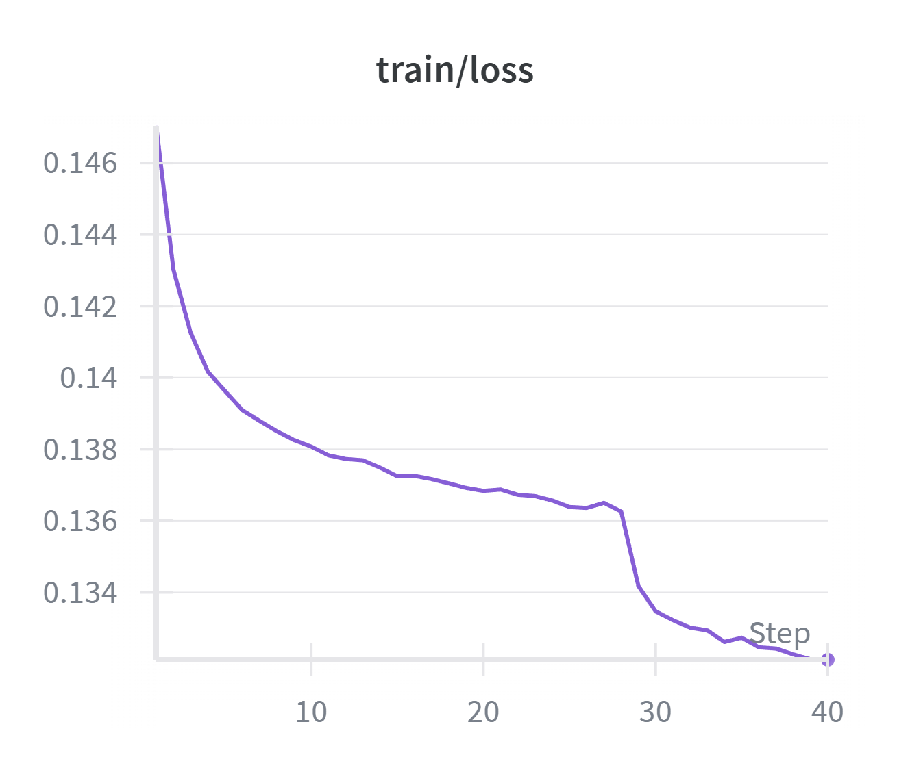
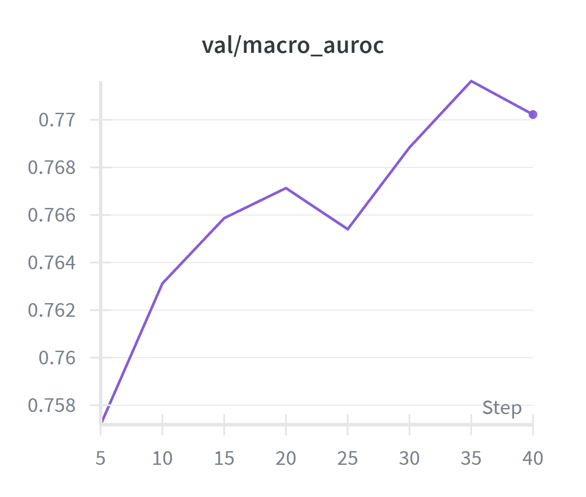
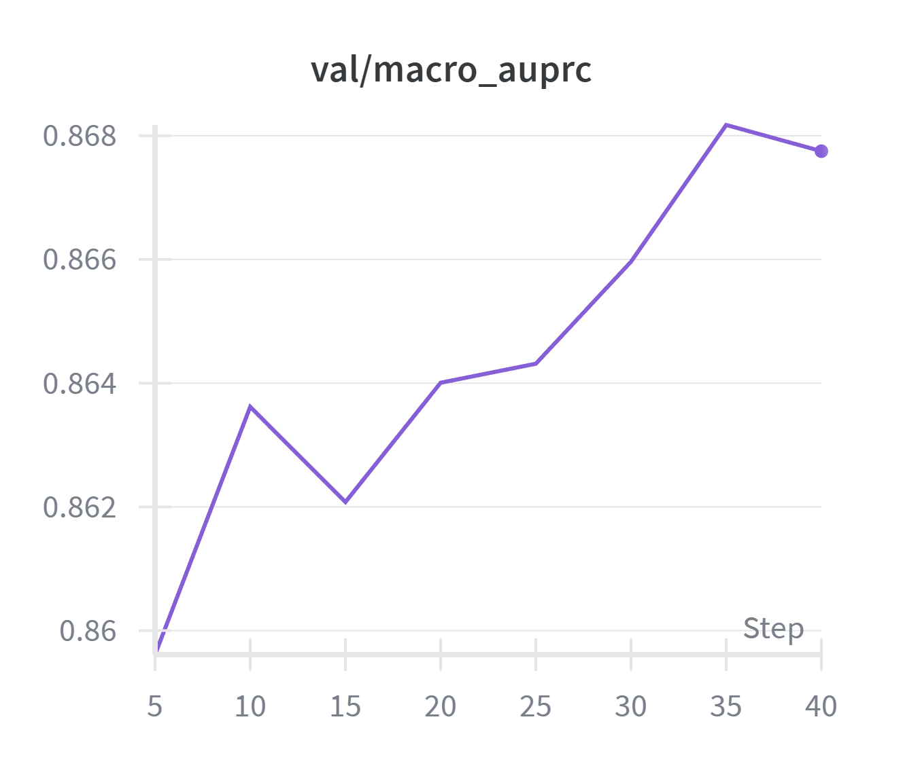
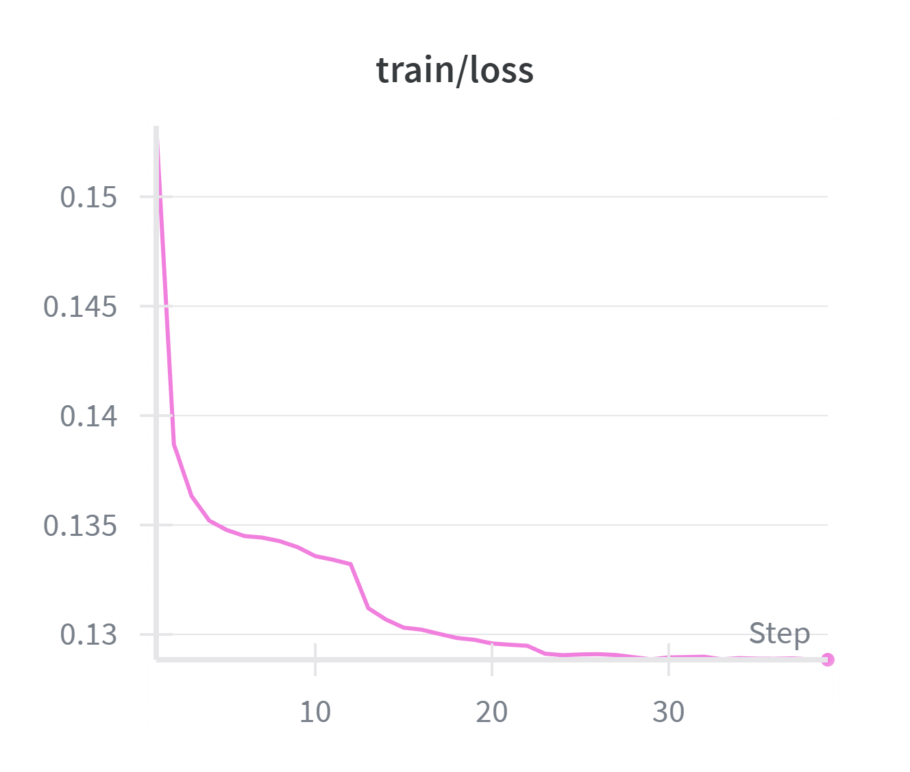
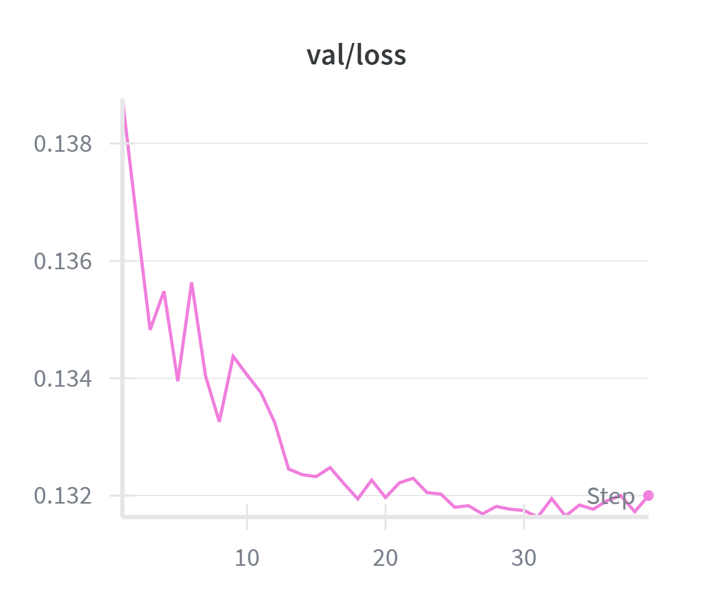
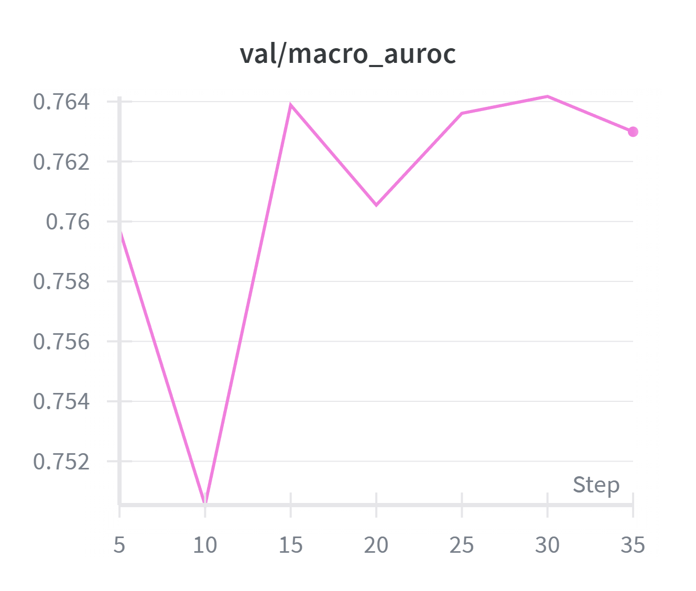
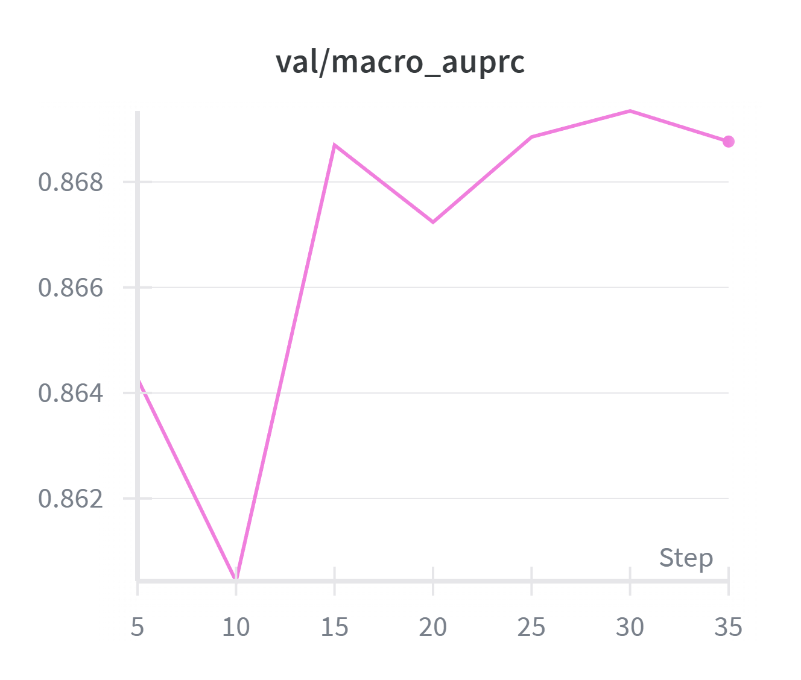

# Chest X-ray Multi-label Classification
## Ensemble Learning and Recall-driven Class-wise Threshold Optimization

본 프로젝트는 흉부 X-ray 이미지 기반 다중 질병(Multi-label) 분류 모델을 구축하고, 의료 데이터의 **불완전 라벨( NaN, -1 )** 및 **심각한 불균형**을 고려하여 **Recall 중심(Class-wise) 임계값 최적화**까지 수행하는 실험이다.  
단순히 “모델 성능이 더 높다”를 말하기보다, **의료 환경에서 놓치면 안 되는 질병( False Negative )을 최소화**하는 의사결정 기준을 설계하는 데 초점을 둔다.

---

## 1. Motivation

흉부 X-ray 다중 라벨 문제는 다음과 같은 구조적 난점을 갖는다.

- **클래스별 샘플 수 불균형**(disease prevalence 차이)
- **클래스 내부 양성/음성 비율 불균형**(양성 희소)
- 라벨에 **NaN**뿐 아니라 **-1(uncertain)**이 존재함
- 같은 AUROC/AUPRC여도, **임계값 선택에 따라 임상적 위험(FN/FP)이 크게 달라짐**

의료 데이터에서는 **Recall(민감도)**가 핵심 제약 조건이 되기 쉽다.  
따라서 본 프로젝트는 최종 단계에서 **“Recall ≥ r” 제약 하에서 Precision을 최대화하는 Class-wise Threshold**를 탐색한다.

---

## 2. Label Handling & Imbalance Strategy

### 2.1 불완전 라벨 처리: Mask 기반 BCE

라벨은 다음 값을 포함한다.

- `1` : Positive  
- `0` : Negative  
- `-1` : Uncertain  
- `NaN` : Missing

`-1`과 `NaN`을 임의로 0/1로 치환하면 의료적 의미가 왜곡될 수 있다.  
따라서 학습 시 **유효 라벨에 대해서만 loss가 계산되도록 mask**를 구성하여 반영한다.

- 핵심 아이디어: `mask == 1`인 항목만 BCE loss 계산에 포함
- 구현 위치: `src/train_utils.py`, `src/engine.py`

---

### 2.2 라벨 불균형 보정: `pos_weight`

각 클래스의 양성 비율을 기반으로 `pos_weight`를 계산하여 `BCEWithLogitsLoss`에 적용한다.

- `pos_weight`는 각 클래스 내부의 positive/negative 불균형을 직접적으로 보정한다.
- 이는 양성 샘플이 희소한 질병 클래스에서 학습 신호를 강화하는 효과를 가지며,
  결과적으로 클래스 간 성능 격차를 완화하는 방향으로 작용할 수 있다.
- 다만, 클래스별 전체 샘플 수 차이를 직접적으로 재조정하는 기법은 아니다.

---

## 3. Pipeline

본 프로젝트의 전체 흐름은 다음과 같다.

1. **단일 모델 학습(ResNet50 / EfficientNet-B1)**  
2. **앙상블(가중 평균, alpha 탐색)**  
3. **Class-wise Threshold 최적화(Recall 제약 기반)**

---

## 4. Models

- **ResNet50 (ImageNet pretrained)**
  - 최종 FC 레이어를 13-class multi-label 출력으로 교체
  - 일부 블록을 unfreeze하여 fine-tuning 수행

- **EfficientNet-B1 (ImageNet pretrained)**
  - classifier 레이어 교체
  - 마지막 N blocks unfreeze하여 fine-tuning 수행

---

## 5. Training Setup

- Optimizer: **AdamW**
- Scheduler: ReduceLROnPlateau
- Early Stopping 적용
- Metric(검증/테스트):
  - Threshold-independent: **Macro AUROC / Macro AUPRC**
  - Threshold-dependent(최종): **Recall constraint 기반 Accuracy(및 class-wise precision/threshold)**

---

## 6. Experiments & Tuning Summary

### 6.1 Tuning Log (Validation 기준)

본 프로젝트에서는 여러 차례 하이퍼파라미터 조정을 수행하였다.

- Learning rate 변경
- Weight decay 조정
- Unfreeze 범위 조정
- Scheduler/Early Stopping 설정 변경

이 중 README에는 **성능 향상이 가장 유의미하게 관찰된 회차(1차 → 2차)**만 기록하였다.

아래 표는 “1차 → 2차 튜닝”에서 구성 변경 및 검증 성능 변화를 요약한 것이다.

#### ResNet50 튜닝 요약

| Run | 핵심 변경 | Best Val AUROC | Best Val AUPRC |
|---|---|---:|---:|
| 1차 | `unfreeze_from="layer4"` | 0.7648 | 0.8632 |
| 2차 | `unfreeze_from="layer3"` | **0.7702** | **0.8678** |

해석: unfreeze 범위를 확대(layer3부터)하고 학습률/정규화를 유지한 상태에서 **AUPRC가 안정적으로 상승**하였다.

#### EfficientNet-B1 튜닝 요약

| Run | 핵심 변경 | Best Val AUROC | Best Val AUPRC |
|---|---|---:|---:|
| 1차 | `unfreeze_last_n_blocks=2` | 0.7584 | 0.8586 |
| 2차 | `unfreeze_last_n_blocks=3` | **0.7647** | **0.8697** |

해석: 마지막 블록 unfreeze 수를 늘려 표현력을 확장했고, **AUPRC가 소폭 상승**하였다.

---

### 6.2 Learning Curves (assets)

#### ResNet50

<p align="center">
  
  
  
  
</p>

#### EfficientNet-B1

<p align="center">
  
  
  
  
</p>

---

## 7. Final Test Performance (2차 학습 최종 결과)

> 아래 single-model test 성능은 **1차가 아니라 2차 학습의 최종 결과**이다.

### 7.1 Single Model (Test)

| Model | Loss | Accuracy | Macro AUROC | Macro AUPRC |
|---|---:|---:|---:|---:|
| ResNet50 | 0.3474 | 0.4054 | 0.7627 | 0.8664 |
| EfficientNet-B1 | 0.3390 | 0.4081 | 0.7629 | 0.8657 |

두 모델은 유사한 수준의 threshold-independent 성능을 보인다.  
이후 단계에서는 “단일 모델의 최고점”이 아니라, **앙상블 + Recall 중심 임계값 설계**로 의사결정 품질을 개선한다.

---


---

## 8. Ensemble

### 8.1 Alpha Search (Validation)

앙상블은 두 모델의 예측 확률을 가중 평균하여 계산한다.

```python
p = alpha * p_resnet + (1 - alpha) * p_efficientnet
```

Validation 데이터에서 alpha 값을 0.0 ~ 1.0 범위로 탐색하였다.

| alpha | Val Accuracy | Val Macro AUROC | Val Macro AUPRC |
|------:|-------------:|----------------:|----------------:|
| 0.0 | 0.4008 | 0.7647 | 0.8697 |
| 0.1 | 0.4003 | 0.7699 | 0.8722 |
| 0.2 | 0.4001 | 0.7741 | 0.8743 |
| 0.3 | 0.3995 | 0.7772 | 0.8760 |
| 0.4 | 0.3996 | 0.7793 | 0.8771 |
| 0.5 | **0.3998** | **0.7806** | **0.8776** |
| 0.6 | 0.3999 | 0.7809 | 0.8775 |
| 0.7 | 0.3998 | 0.7801 | 0.8766 |
| 0.8 | 0.3994 | 0.7782 | 0.8749 |
| 0.9 | 0.3999 | 0.7751 | 0.8720 |
| 1.0 | 0.3999 | 0.7702 | 0.8678 |

Validation 기준으로 AUPRC가 가장 높은 alpha=0.5를 최적값으로 선정하였다.

이는 두 모델이 서로 다른 오류 패턴을 보이며, 적절한 가중 결합을 통해 확률 예측의 안정성이 향상됨을 의미한다.

---

### 8.2 Test Performance (Ensemble)

최적 alpha=0.5를 적용한 Test 결과는 다음과 같다.

| Model | Accuracy | Macro AUROC | Macro AUPRC |
|-------|----------|-------------|-------------|
| ResNet50 | 0.4054 | 0.7627 | 0.8664 |
| EfficientNet-B1 | 0.4081 | 0.7629 | 0.8657 |
| **Ensemble (α=0.50)** | **0.4060** | **0.7732** | **0.8747** |

앙상블 적용 시 단일 모델 대비 다음과 같은 향상이 관찰되었다.

- Macro AUROC: 0.7629 → **0.7732**
- Macro AUPRC: 0.8664 → **0.8747**
- Accuracy는 단일 모델 대비 유사한 수준을 유지하였다.

이는 두 모델의 오류 패턴이 상호 보완적으로 작용하여 확률 예측의 분산이 감소했음을 시사한다.

---

## 9. Class-wise Threshold Optimization (Recall-driven Strategy)

의료 데이터 특성상 False Negative 최소화가 중요하므로  
Recall을 기준으로 클래스별 임계값을 독립적으로 탐색하였다.

---

### 9.1 Threshold-independent Performance

| Metric | Score |
|--------|-------|
| Macro AUROC | 0.7732 |
| Macro AUPRC | 0.8747 |

Macro AUPRC 0.8747은 모델이 전반적으로 양성 클래스에 대해 안정적인 확률 예측 능력을 보유하고 있음을 의미한다.

---

### 9.2 Recall ≥ 0.85 조건

| Class | Threshold | Precision | AUPRC |
|--------|----------|-----------|--------|
| Atelectasis | 0.000 | 0.9698 | 0.9828 |
| Cardiomegaly | 0.050 | 0.8370 | 0.9218 |
| Consolidation | 0.030 | 0.7867 | 0.8932 |
| Edema | 0.110 | 0.7916 | 0.8857 |
| Enlarged Cardiomediastinum | 0.010 | 0.5829 | 0.8072 |
| Fracture | 0.000 | 0.8085 | 0.8773 |
| Lung Lesion | 0.000 | 0.8589 | 0.9226 |
| Lung Opacity | 0.010 | 0.9527 | 0.9799 |
| Pleural Effusion | 0.160 | 0.9235 | 0.9617 |
| Pleural Other | 0.000 | 0.9481 | 0.9620 |
| Pneumonia | 0.060 | 0.4611 | 0.6601 |
| Pneumothorax | 0.090 | 0.3028 | 0.5384 |
| Support Devices | 0.010 | 0.9514 | 0.9779 |

Test Accuracy (Recall ≥ 0.85): **0.7959**

#### 해석

- 고신뢰 클래스 (AUPRC ≥ 0.95):  
  Atelectasis, Lung Opacity, Pleural Effusion, Pleural Other, Support Devices  
  → 낮은 threshold에서도 높은 Precision 유지

- 중간 안정성 클래스:  
  Cardiomegaly, Consolidation, Edema, Fracture, Lung Lesion  
  → Recall 확보 시 Precision 일부 감소

- 불안정 클래스:  
  Pneumonia (0.4611), Pneumothorax (0.3028)  
  → Recall 확보 과정에서 Precision 급감

---

### 9.3 Recall ≥ 0.9 조건

| Class | Threshold | Precision |
|--------|----------|-----------|
| Atelectasis | 0.000 | 0.9698 |
| Cardiomegaly | 0.040 | 0.8170 |
| Consolidation | 0.020 | 0.7093 |
| Edema | 0.070 | 0.7309 |
| Enlarged Cardiomediastinum | 0.010 | 0.5829 |
| Fracture | 0.000 | 0.8085 |
| Lung Lesion | 0.000 | 0.8589 |
| Lung Opacity | 0.000 | 0.9357 |
| Pleural Effusion | 0.110 | 0.8910 |
| Pleural Other | 0.000 | 0.9481 |
| Pneumonia | 0.050 | 0.4292 |
| Pneumothorax | 0.060 | 0.2618 |
| Support Devices | 0.010 | 0.9514 |

Test Accuracy (Recall ≥ 0.9): **0.7856**

Recall을 0.9 이상으로 강화할 경우 Precision 감소가 전반적으로 나타난다.  
특히 Pneumonia와 Pneumothorax는 임계값을 낮출수록 오탐지 비율이 급격히 증가한다.

---

## 10. Conclusion

본 프로젝트는 단순한 모델 비교가 아니라,

- 불완전 라벨 처리 전략 설계
- pos_weight 기반 불균형 보정
- 앙상블을 통한 확률 안정화
- Recall 중심 임계값 최적화

를 통합적으로 수행한 실험이다.

Macro AUPRC 0.8747은 전반적으로 양호한 확률 예측 능력을 의미한다.  
다만 Pneumonia 및 Pneumothorax 클래스는 구조적 개선이 필요하다.

Recall 기반 임계값 전략은 의료 환경에서 합리적인 의사결정 접근임을 확인하였다.

---

## 11. Future Work

- 클래스별 샘플 불균형에 대한 직접적 대응 (Oversampling / Focal Loss)
- Hard example mining 도입
- 구조 개선 (Attention module 등)
- Class-dependent loss weighting 정교화
- Calibration 기반 확률 보정
- 추가적인 하이퍼파라미터 튜닝

---

## 12. Repository Structure

```
.
├── assets/
├── src/
│   ├── config.py
│   ├── data.py
│   ├── dataset.py
│   ├── models.py
│   ├── engine.py
│   ├── evaluate.py
│   ├── transforms.py
│   ├── train_utils.py
│   └── early_stopping.py
│
├── train_resnet.py
├── train_efficientnet.py
├── test_resnet.py
├── test_efficientnet.py
├── ensemble_alpha_search.py
├── ensemble_threshold_search.py
├── check_split.py
├── eda_labels.py
├── README.md
└── LICENSE
```
